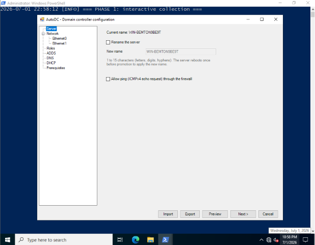
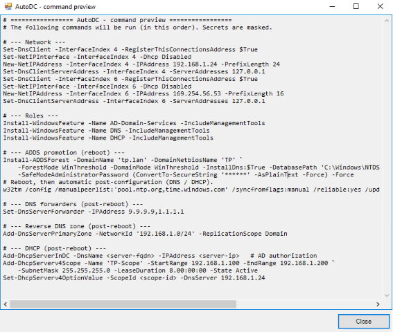

🌐 **Languages**

🇬🇧 English (current) | 🇫🇷 [Français](docs/README.fr.md)

# AutoDC

**Full unattended deployment of a Windows Server domain controller (ADDS + DNS + DHCP) from a single graphical interface.**

## Why this script?

Setting up a domain controller by hand chains together repetitive steps interrupted by reboots (network → roles → promotion → DNS/DHCP). AutoDC gathers all the input in a single window, then runs the rest on its own while handling the reboots. Ideal for quickly building and rebuilding DCs in a lab on VMs.



### Advantages
- All in one pass, no intervention after the input (reboots handled, automatic resume).
- Windows Server wizard-style interface, with built-in validation and a command preview before execution.
- Reusable configuration (import/export); passwords are never stored in clear text.

### Limitations
- Windows Server 2019 / 2022 / 2025 only (PowerShell 5.1+).
- Meant for labs, not for a critical production environment.
- The server reboots automatically → run it from the VM console, not over RDP.
- AutoDC installs the DC but does not populate the domain (OUs, users, groups) — that is the job of its companion tool [**ADFlow**](https://github.com/Aractuse/ADFlow).

## Quick start

1. Copy `Start-AutoDC.ps1` to the server, then right-click → Run with PowerShell (it elevates to administrator on its own).
2. Fill in the tabs (Server → Network → Roles → ADDS/DNS/DHCP → Prerequisites) and click **Launch**.
3. Let it run: the configuration is applied, the server reboots once or twice and finishes on its own. A window shows the live progress at logon.

```powershell
# From an administrator console, in the script's folder:
powershell -ExecutionPolicy Bypass -File .\Start-AutoDC.ps1
```

> ⚠️ The server reboots during deployment: run it from the VM **console** (a network reconfiguration can drop an RDP session).




<!-- 📸 SCREENSHOT TO ADD (optional): the "Preview" button showing the list of commands before execution. Suggested file: docs/preview.png -->

## How it works

The deployment goes through several phases that survive reboots thanks to self-cleaning scheduled tasks:

```
Interactive  →  (rename + reboot)  →  Promote (ADDS promotion + reboot)  →  Configure (DNS + DHCP)
```

Secrets (DSRM, domain admin) are encrypted with **DPAPI (machine scope)** for the duration of the reboots, then wiped — never in clear text on disk nor in the exported configuration file.

## Author

**Taeckens.M** — see also [**ADFlow**](https://github.com/Aractuse/ADFlow), the companion tool that *populates* the domain (OUs, users, groups…) from a simple definition file.
